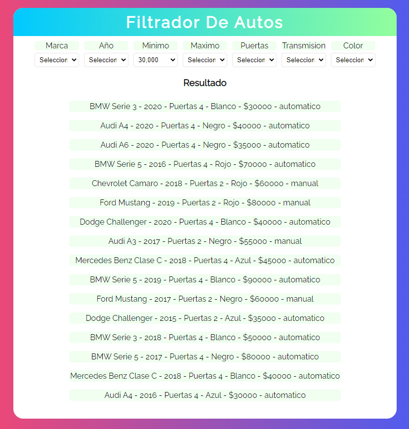

# Filtrador de autos

Tercer proyecto realizado del <a href="https://www.udemy.com/course/javascript-moderno-guia-definitiva-construye-10-proyectos/">curso de udemy</a> con el aprendizaje de videos previos, en javascript vanilla.

> *Contiene un array de objetos los cuales son los autos y sus caracteristicas, en total son siete filtros, cada select tiene una escucha de cambio de opcion, al cambiar la opcion/filtro se almacenan en un nuevo objeto y despues se comparan con el array original, si coincide se limpia el contenedor  y se imprimen los que aplican con el filtro, en caso de no coincidir devuelve un mensaje de error impreso.
- <a href="https://sonnyrmt.github.io/formulary/" target="_blank">Ingresar al filtrador</a>

